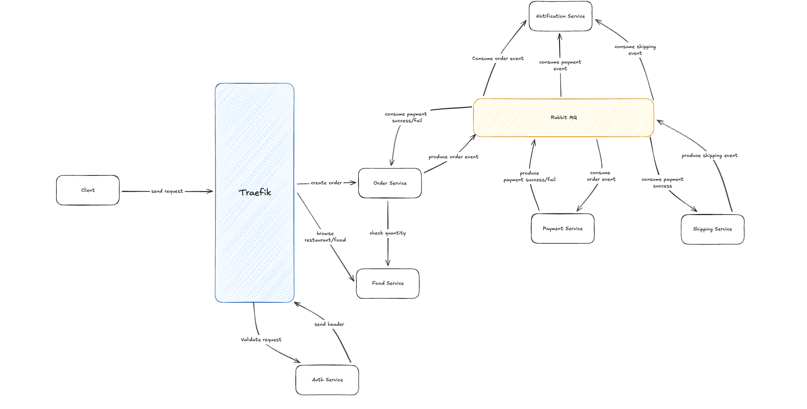

# Food Delivery Microservice

a microservice architecture for food delivery system built with Go.

## Architecture



## Services

- Api Gateway [8080]
- User Service [8081]
- Order Service [8082]
- Payment Service [8084]
- Food Service [8083]

## Features

- User Service

  - Register
  - Login
  - Get User

- Order Service

  - Create Order
  - Get Order

- Payment Service

  - Create Payment
  - Get Payment

- Food Service

  - Create Food
  - Get Food

- Delivery Service
  - Get delivery status
  - Update delivery status

## Service Structure

Each service is using layered architecture that contains repository, service, and controller layer.

## Tools

- RabbitMQ
- PostgreSQL
- Traefik
- Gorm

## Getting Started

### Prerequisites

- Go 1.21+
- Docker & Docker Compose
- PostgreSQL (for local development)

### Running with Docker Compose

1. **Clone the repository**

   ```bash
   git clone <repository-url>
   cd food-delivery
   ```

2. **Start all services**

   ```bash
   docker compose up --build -d
   ```

3. **Check running containers**

   ```bash
   docker compose ps
   ```

4. **View logs**

   ```bash
   docker compose logs -f
   ```

5. **Stop all services**
   ```bash
   docker compose down
   ```

> **Note:** The services connect to PostgreSQL running on your local machine via `host.docker.internal`. Make sure PostgreSQL is running locally on port 5432.

### Running Locally (Without Docker)

1. **Start PostgreSQL** on port 5432

2. **Create databases** for each service:

   ```sql
   CREATE DATABASE "food-service-db";
   CREATE DATABASE "user-service-db";
   CREATE DATABASE "order-service-db";
   CREATE DATABASE "payment-service-db";
   ```

3. **Start RabbitMQ**

   ```bash
   docker run -d --name rabbitmq -p 5672:5672 -p 15672:15672 rabbitmq:3-management
   ```

4. **Configure environment files** for each service:

   - Copy `.env.example` to `.env` in each service directory
   - Update the database connection strings if needed

5. **Run each service** (in separate terminals):

   ```bash
   # User Service (port 8081)
   cd services/user-service
   go run .

   # Food Service (port 8082)
   cd services/food-service
   go run .

   # Order Service (port 8083)
   cd services/order-service
   go run .

   # Payment Service (port 8084)
   cd services/payment-service
   go run .
   ```

6. **Start Traefik** (optional, for API Gateway):
   ```bash
   docker run -d -p 80:80 -p 8080:8080 \
     -v $(pwd)/traefik/traefik.toml:/etc/traefik/traefik.toml:ro \
     -v $(pwd)/traefik/dynamic.toml:/etc/traefik/dynamic-docker.toml:ro \
     traefik:v2.10
   ```

## API Endpoints

All endpoints are accessible via Traefik on port 80:

| Service         | Path Prefix    | Example                                        |
| --------------- | -------------- | ---------------------------------------------- |
| Food Service    | `/api/food`    | `GET http://localhost/api/food/restaurant/:id` |
| User Service    | `/api/user`    | `POST http://localhost/api/user/register`      |
| Order Service   | `/api/order`   | `POST http://localhost/api/order`              |
| Payment Service | `/api/payment` | `POST http://localhost/api/payment`            |

### Direct Access (Without Traefik)

| Service         | Port | Example                                    |
| --------------- | ---- | ------------------------------------------ |
| User Service    | 8081 | `GET http://localhost:8081/health`         |
| Food Service    | 8082 | `GET http://localhost:8082/restaurant/:id` |
| Order Service   | 8083 | `GET http://localhost:8083/order/:id`      |
| Payment Service | 8084 | `GET http://localhost:8084/payment/:id`    |

## Cons

- Every service need to validate the request from client

## Contact

email: magistaagis@gmail.com
twitter: @magistrapta
