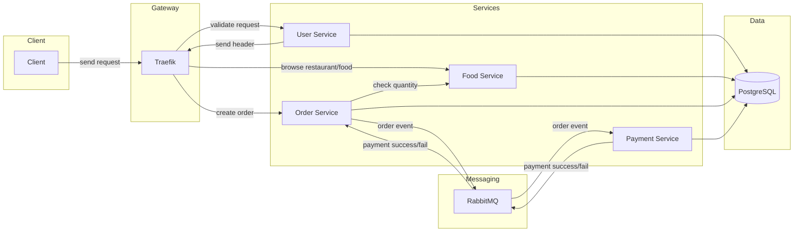
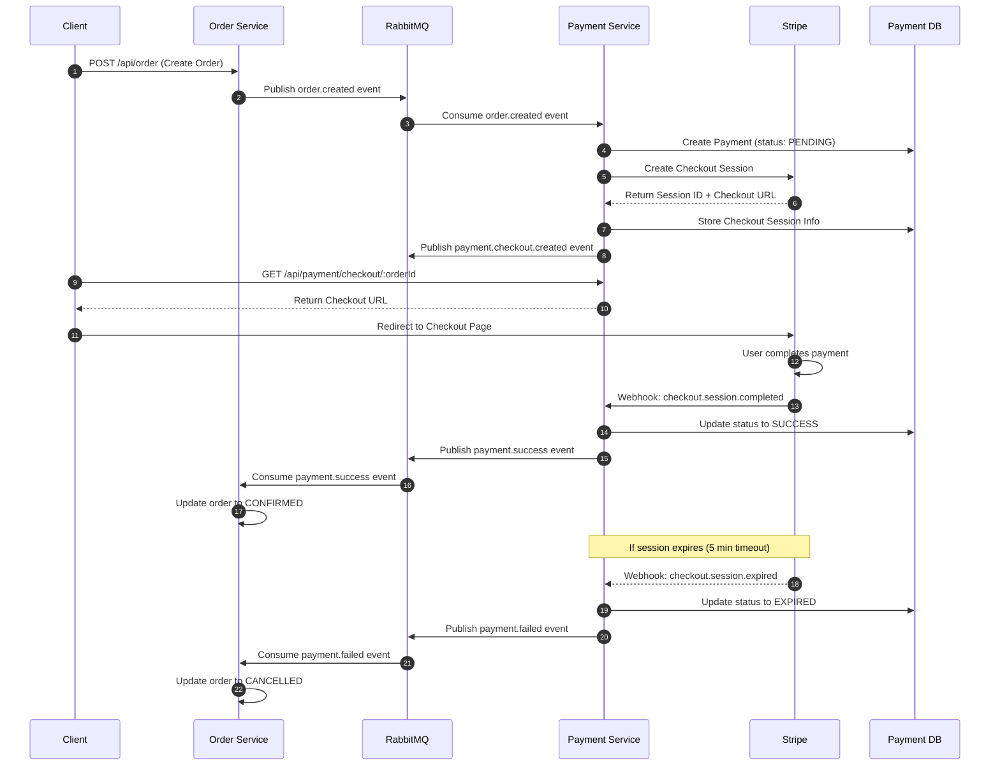

# Food Delivery Microservice
Food-delivery is a HTTP-based web app that simulates food delivery service such as Doordash, Gojek Food, or Uber Food.

This application is created to simulate the development process of microservice project from running on Kubernetes cluster and AWS cloud service.

If you find this application helpful, don't forget to give a star! ⭐️

## Architecture


```mermaid
flowchart LR
  subgraph Client
    C[Client]
  end

  subgraph Gateway
    T[Traefik]
  end

  subgraph Services
    A[User Service]
    F[Food Service]
    O[Order Service]
    P[Payment Service]
  end

  subgraph Messaging
    R[RabbitMQ]
  end

  subgraph Data
    DB[(PostgreSQL)]
  end

  C -->|send request| T
  T -->|validate request| A
  A -->|send header| T
  T -->|browse restaurant/food| F
  T -->|create order| O
  O -->|check quantity| F
  O -->|order event| R
  R -->|order event| P
  P -->|payment success/fail| R
  R -->|payment success/fail| O
  A --> DB
  F --> DB
  O --> DB
  P --> DB
```

## Services

| Service         | Language   | Description |
| --------------- | ---------- | ----------- |
| user-service    | Go         | Manages user accounts and authentication. Register, login, get user. Signs JWTs used for authentication by other services. |
| food-service    | Go         | Browse restaurants and food, create food. Exposes restaurant and menu data. Order service calls it to check quantity. |
| order-service   | Go         | Creates and retrieves orders. Publishes order events to RabbitMQ; consumes payment success/fail events to update order status. |
| payment-service | Go         | Handles payments via Stripe Checkout. Consumes order events from RabbitMQ, creates checkout sessions, publishes payment success/fail events. |
| traefik         | Go         | API gateway and reverse proxy. Routes client requests to services and exposes dashboard. |
| rabbitmq        | Erlang     | Message broker for asynchronous events between order and payment services. |
| PostgreSQL      | SQL        | Databases per service (user-service-db, food-service-db, order-service-db, payment-service-db). |

## Tools

- RabbitMQ
- PostgreSQL
- Traefik
- Gorm

## Getting Started

### Prerequisites

- Go 1.21+
- Docker & Docker Compose
- PostgreSQL (for local development)

### Quick Start with Makefile

This project includes a comprehensive Makefile for easy development. Run `make help` to see all available commands:

```bash
make help
```

#### 1. Clone and Setup

```bash
git clone <repository-url>
cd food-delivery
```

#### 2. Configure Environment

Copy `.env.example` to `.env` in each service directory and update values as needed:

```bash
cp services/user-service/.env.example services/user-service/.env
cp services/food-service/.env.example services/food-service/.env
cp services/order-service/.env.example services/order-service/.env
cp services/payment-service/.env.example services/payment-service/.env
```

#### 3. Create Databases

Start PostgreSQL and create the required databases:

```sql
CREATE DATABASE "food-service-db";
CREATE DATABASE "user-service-db";
CREATE DATABASE "order-service-db";
CREATE DATABASE "payment-service-db";
```

---

### Running with Docker Compose (Recommended)

The easiest way to run all services:

```bash
# Start all services (including RabbitMQ and Traefik)
make docker-up

# View logs
make logs

# Stop all services
make docker-down
```

**Access Points:**

- RabbitMQ Management: http://localhost:15672 (guest/guest)
- Traefik Dashboard: http://localhost:8080

---

### Running Locally (Development Mode)

For local development with hot-reload capability:

#### Option 1: Run All Services Together

```bash
# Start infrastructure (RabbitMQ, Traefik)
make infra

# Run all services concurrently
make run-all
```

Press `Ctrl+C` to stop all services.

#### Option 2: Run Services Individually

```bash
# Start infrastructure first
make infra

# Run individual services (each in separate terminal)
make run-user      # User Service    → http://localhost:8081
make run-food      # Food Service    → http://localhost:8082
make run-order     # Order Service   → http://localhost:8083
make run-payment   # Payment Service → http://localhost:8084
```

---

### Build & Test Commands

```bash
# Build all services
make build-all

# Build individual service
make build-user
make build-food
make build-order
make build-payment

# Run all tests
make test-all

# Test individual service
make test-user
make test-food
make test-order
make test-payment
```

---

### Utility Commands

```bash
# Install/update dependencies
make deps

# Format code
make fmt

# Run linter (requires golangci-lint)
make lint

# Clean build artifacts
make clean
```

---

### Makefile Commands Reference

| Command             | Description                              |
| ------------------- | ---------------------------------------- |
| `make help`         | Show all available commands              |
| `make infra`        | Start infrastructure (RabbitMQ, Traefik) |
| `make infra-down`   | Stop infrastructure                      |
| `make run-all`      | Run all services concurrently            |
| `make run-user`     | Run user-service (port 8081)             |
| `make run-food`     | Run food-service (port 8082)             |
| `make run-order`    | Run order-service (port 8083)            |
| `make run-payment`  | Run payment-service (port 8084)          |
| `make build-all`    | Build all services                       |
| `make test-all`     | Test all services                        |
| `make docker-up`    | Start all services with Docker Compose   |
| `make docker-down`  | Stop all Docker services                 |
| `make docker-build` | Build all Docker images                  |
| `make logs`         | View Docker logs                         |
| `make deps`         | Install dependencies for all services    |
| `make fmt`          | Format code in all services              |
| `make lint`         | Run linter on all services               |
| `make clean`        | Clean build artifacts                    |

## API Endpoints

All endpoints are accessible via Traefik on port 80:

| Service         | Path Prefix    | Example                                        |
| --------------- | -------------- | ---------------------------------------------- |
| Food Service    | `/api/food`    | `GET http://localhost/api/food/restaurant/:id` |
| User Service    | `/api/user`    | `POST http://localhost/api/user/register`      |
| Order Service   | `/api/order`   | `POST http://localhost/api/order`              |
| Payment Service | `/api/payment` | `POST http://localhost/api/payment`            |

### Direct Access (Without Traefik)

| Service         | Port | Example                                       |
| --------------- | ---- | --------------------------------------------- |
| User Service    | 8081 | `GET http://localhost:8081/health`            |
| Food Service    | 8082 | `GET http://localhost:8082/restaurant/:id`    |
| Order Service   | 8083 | `GET http://localhost:8083/order/:id`         |
| Payment Service | 8084 | `GET http://localhost:8084/checkout/:orderId` |

## Payment Flow

The payment system uses **Stripe Checkout** for secure payment processing:


```mermaid
sequenceDiagram
    autonumber
    participant Client
    participant OrderService as Order Service
    participant RabbitMQ
    participant PaymentService as Payment Service
    participant Stripe
    participant Database as Payment DB

    %% Order Creation
    Client->>OrderService: POST /api/order (Create Order)
    OrderService->>RabbitMQ: Publish order.created event

    %% Payment Processing
    RabbitMQ->>PaymentService: Consume order.created event
    PaymentService->>Database: Create Payment (status: PENDING)
    PaymentService->>Stripe: Create Checkout Session
    Stripe-->>PaymentService: Return Session ID + Checkout URL
    PaymentService->>Database: Store Checkout Session Info
    PaymentService->>RabbitMQ: Publish payment.checkout.created event

    %% Client Gets Checkout URL
    Client->>PaymentService: GET /api/payment/checkout/:orderId
    PaymentService-->>Client: Return Checkout URL

    %% User Pays on Stripe
    Client->>Stripe: Redirect to Checkout Page
    Stripe->>Stripe: User completes payment

    %% Webhook - Success Path
    Stripe->>PaymentService: Webhook: checkout.session.completed
    PaymentService->>Database: Update status to SUCCESS
    PaymentService->>RabbitMQ: Publish payment.success event
    RabbitMQ->>OrderService: Consume payment.success event
    OrderService->>OrderService: Update order to CONFIRMED

    %% Alternative: Timeout/Expiry Path
    Note over Stripe,PaymentService: If session expires (5 min timeout)
    Stripe-->>PaymentService: Webhook: checkout.session.expired
    PaymentService->>Database: Update status to EXPIRED
    PaymentService->>RabbitMQ: Publish payment.failed event
    RabbitMQ->>OrderService: Consume payment.failed event
    OrderService->>OrderService: Update order to CANCELLED
```

### Payment Endpoints

| Endpoint                         | Method | Description                          |
| -------------------------------- | ------ | ------------------------------------ |
| `/api/payment/checkout/:orderId` | GET    | Get Stripe Checkout URL for an order |
| `/api/payment/status/:orderId`   | GET    | Get payment status for an order      |
| `/api/payment/webhook/stripe`    | POST   | Stripe webhook endpoint              |

### Payment Timeout

If payment is not completed within **5 minutes**, the order is automatically cancelled.


## Kubernetes

To run the application in Kubernetes you can apply the YAML files in the `k8s/` folder.


### Colima (local cluster)

Colima uses its own Docker daemon, so images built on your host are not visible to the cluster. Build images using the Colima Docker context before applying manifests:

```bash
# 1. Start Colima with Kubernetes
colima start --with-kubernetes

# 2. Use Colima's Docker context and build app images (required once per image change)
docker context use colima
./build-colima.sh

# 3. Apply manifests
./apply-k8s.sh

# 4. (Optional) Expose ingress locally
colima tunnel
```

Without step 2, deployments will stay in `ImagePullBackOff` or `ErrImageNeverPull` because `food-service:latest`, `order-service:latest`, etc. do not exist in Colima's image cache.

### Without Colima

If you use a different cluster (e.g. kind, minikube, cloud) and push images to a registry, update the deployment `image` fields to your registry URLs and set `imagePullPolicy: IfNotPresent` (or remove it).

### Troubleshooting

**"field is immutable" when reapplying ingress-nginx**

If you install the NGINX Ingress controller from the official manifest (e.g. `kubectl apply -f https://raw.githubusercontent.com/kubernetes/ingress-nginx/controller-v1.11.1/deploy/static/provider/cloud/deploy.yaml`) and later re-apply it, the admission webhook Jobs (`ingress-nginx-admission-create`, `ingress-nginx-admission-patch`) fail because Job pod templates are immutable. Fix by deleting those Jobs once; the next apply will recreate them and the webhook cert is already in a Secret:

```bash
kubectl delete job ingress-nginx-admission-create ingress-nginx-admission-patch -n ingress-nginx --ignore-not-found
```

Then re-run your apply.

## To-do List

- [x] Return Stripe Payment URL
- [x] Setup Unit test
- [x] Setup Kubernetes
- [ ] Setup CI/CD
- [ ] Deploy on AWS

## Contact

email: magistaagis@gmail.com
twitter: @magistrapta
